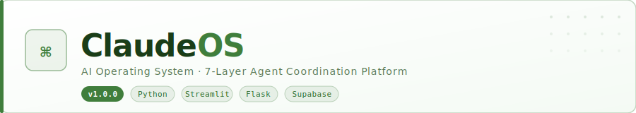

<p align="center">
  <picture>
    <source media="(prefers-color-scheme: dark)" srcset="assets/banner-dark.svg">
    <source media="(prefers-color-scheme: light)" srcset="assets/banner-light.svg">
    
  </picture>
</p>

<p align="center">
  
  
  
  
  
  
</p>

<p align="center">
  Coordination layer unifying Claude Code skills, agents, and workflows into a single AI control center.
</p>

---

## Architecture

```
┌─────────────────────────────────────────────┐
│  Layer 0 · Streamlit Dashboard   :8501       │
├─────────────────────────────────────────────┤
│  Layer 1 · Flask REST API        :5000       │
├──────────────┬──────────────────────────────┤
│  Layer 2     │  Memory Engine               │
│  SQLite FTS5 │  ChromaDB vectors            │
├──────────────┼──────────────────────────────┤
│  Layer 3     │  Agent Registry              │
│  12 agents   │  YAML definitions            │
├──────────────┼──────────────────────────────┤
│  Layer 4     │  Workflow Engine             │
│  APScheduler │  7 pipelines                 │
├──────────────┼──────────────────────────────┤
│  Layer 5     │  Client Vault                │
│  Namespaces  │  Isolated workspaces         │
├──────────────┼──────────────────────────────┤
│  Layer 6     │  Output Manager              │
│  Auto-tag    │  FTS search · Export         │
├──────────────┼──────────────────────────────┤
│  Layer 7     │  Supabase Cloud Sync         │
│  Push-only   │  Watermark · Auto 15min      │
├──────────────┼──────────────────────────────┤
│  Layer 8     │  Auth & Security             │
│  JWT/bcrypt  │  Roles · Audit log           │
├──────────────┼──────────────────────────────┤
│  Layer 9     │  Ticketing System            │
│  SLA tiers   │  Staff role · Bulk ops       │
└──────────────┴──────────────────────────────┘
```

## Roles

| Role | Access |
|------|--------|
| `admin` | Full access — all namespaces, user management, admin panel |
| `operator` | All namespaces, all resources; no user management |
| `client` | Own namespace only; read/write memory, run agents, view outputs |
| `viewer` | Own namespace, read-only |
| `staff` | Sees only assigned tickets; can self-assign and advance ticket status |

## Setup

### Requirements
- Python 3.11+
- Windows 10 / PowerShell

### Install

```powershell
git clone https://github.com/Obinwanne1/ClaudeOS.git
cd ClaudeOS
pip install -r requirements.txt
```

### Configure

```powershell
copy .env.example .env
```

Edit `.env`:

```env
ANTHROPIC_API_KEY=your_key_here
CLAUDEOS_SECRET_KEY=change_this_in_prod

# Optional: Supabase cloud sync
SUPABASE_URL=https://your-project.supabase.co
SUPABASE_SERVICE_KEY=your_service_role_key
```

### Migrate + Seed

```powershell
python scripts/migrate.py
python scripts/seed_agents.py
python scripts/seed_workflows.py
python scripts/seed_namespaces.py
```

### Start

```powershell
.\scripts\start.ps1
```

| Service | URL |
|---------|-----|
| Dashboard | http://localhost:8501 |
| API | http://localhost:5000/api/v1/health |

## Cloud Sync

1. Create a [Supabase](https://supabase.com) project
2. Run `sync/supabase_schema.sql` in Supabase SQL Editor
3. Add credentials to `.env` and restart
4. Auto-sync fires every 15 minutes — or trigger manually from the **Settings** tab

## API Reference

| Method | Endpoint | Description |
|--------|----------|-------------|
| `GET` | `/api/v1/health` | System health |
| `GET/POST` | `/api/v1/memory` | Memory entries |
| `GET` | `/api/v1/agents` | List agents |
| `POST` | `/api/v1/agents/{id}/run` | Run agent |
| `GET` | `/api/v1/workflows` | List workflows |
| `POST` | `/api/v1/workflows/{id}/trigger` | Trigger workflow |
| `GET` | `/api/v1/outputs` | List outputs |
| `DELETE` | `/api/v1/outputs/bulk` | Bulk delete outputs |
| `GET/POST` | `/api/v1/tickets` | List / create tickets |
| `GET/PUT/DELETE` | `/api/v1/tickets/{id}` | Get, update, or delete a ticket |
| `DELETE` | `/api/v1/tickets/bulk` | Bulk delete tickets |
| `GET` | `/api/v1/tickets/stats` | Ticket counts by status/priority |
| `GET` | `/api/v1/sync/status` | Sync status |
| `POST` | `/api/v1/sync/push` | Push to Supabase |

## Performance

- Parallel API calls via `ThreadPoolExecutor` — overview data fetched in one shot
- Ticket assignees batch-fetched in a single query (N+1 eliminated)
- Ticket comments lazy-loaded on toggle — not fetched on every card render
- `_cached_api_get` cache key scoped per JWT token — no cross-user cache pollution
- Bulk session revoke uses single `UPDATE ... WHERE id IN (...)` — no per-row loop
- `ticket_stats` aggregates 5 metrics in 3 queries via `SUM(CASE WHEN ...)`
- `idx_events_created` index on `system_events(created_at DESC)` — migration 012
- `_api_key_last_updated` bounded to 500 entries with TTL eviction
- Security settings update uses `executemany` — no per-row loop
- `_is_assignee` uses EXISTS point query — no full list fetch

## Stack

| | |
|--|--|
| **AI** | Anthropic SDK · claude-sonnet-4-6 |
| **Backend** | Flask · waitress (Windows WSGI) |
| **Dashboard** | Streamlit |
| **Memory** | SQLite FTS5 · ChromaDB · sentence-transformers |
| **Scheduler** | APScheduler |
| **Cloud** | Supabase |
| **Testing** | pytest |

## Brand

`#407E3C` green · `#FFFFFF` white · `#5a9e56` accent
